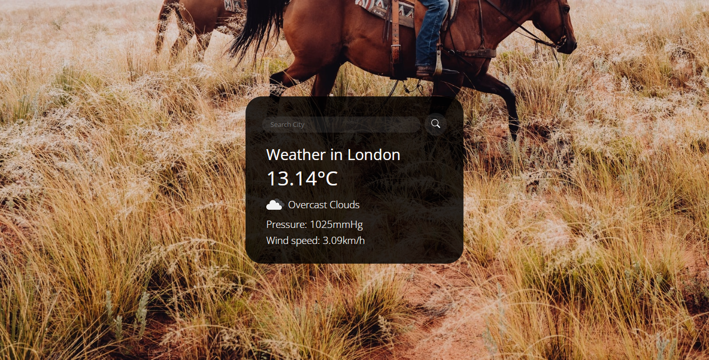

# A Weather App

# Description
This weather App incoporates three(3) Apis namely;
- Geo- location OpenWeather API: to grab coordinates
- Current Weather OpenWaether API: to fetch weather from co-ordinates given
- Geo IPify: to get default city of user

# To use
- Use the search-bar to search for desired city weather

# Screenshot
;

# Live Url
[weatherApp](https://plainsight16.github.io/weatherApp)